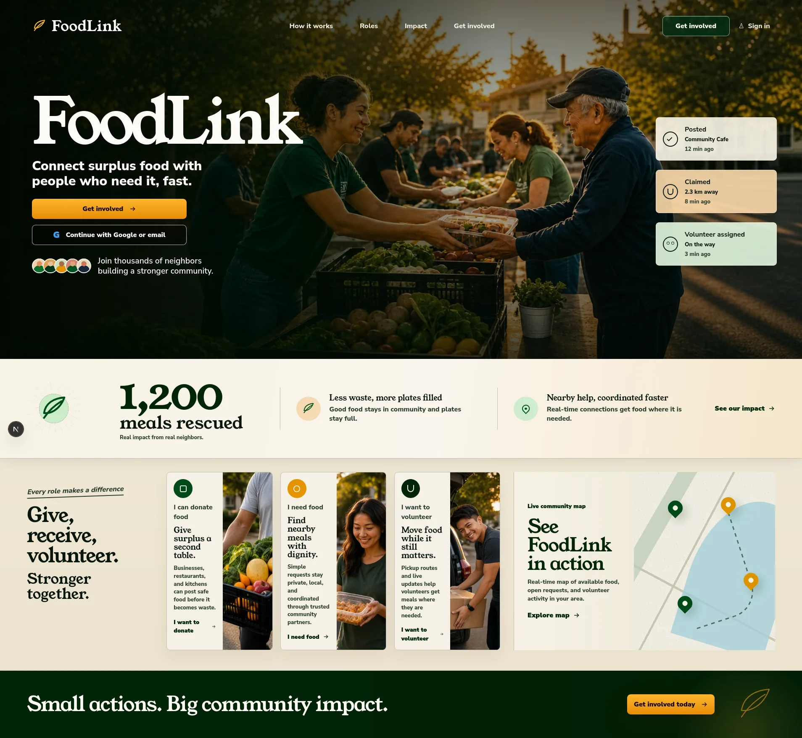

# FoodLink

FoodLink is a demo-first food rescue app for connecting surplus food with people
who need it, coordinated through donors, receivers, and volunteers.

<p align="center"><strong>Watch the Demo Video by Clicking the Image Below</strong></p>

[](https://youtu.be/67UDlpDQFZc)

## Repo Map

| Path | Purpose |
| --- | --- |
| `frontend/` | Next.js app with React, TypeScript, Tailwind CSS, and Biome. |
| `backend/` | Go API service with demo JWT auth and PostgreSQL persistence. |
| `contracts/` | Shared OpenAPI contract for `/api/v1`. |
| `docs/` | Product scope, architecture, frontend, backend, and contract notes. |
| `infra/` | Terraform IaC for AWS backend runtime and Vercel frontend config. |
| `.github/workflows/` | GitHub Actions CI/CD workflow definitions. |

## Stack & Direction

| Area | Current choice |
| --- | --- |
| Product shape | Demo-first workflow with one volunteer-driven matching path end to end. |
| Repo shape | Monorepo with separate frontend and backend deploys. |
| Backend shape | Monolith-first, service-ready later. |
| Frontend | Next.js, React, TypeScript, Tailwind CSS, Biome. |
| Backend | Go, GORM, PostgreSQL. |
| Contracts | OpenAPI 3.0. |
| Maps | Leaflet with OpenStreetMap tiles, plus Google Maps handoff links for volunteer navigation. |
| Asset storage | Cloudinary for donation image uploads. |
| CI/CD | GitHub Actions for frontend CI, backend CI, and backend image publishing. |
| IaC | Terraform for AWS EC2, PostgreSQL RDS, and Vercel frontend configuration. |

## Local Development

1. Start frontend from `frontend/`:

```bash
pnpm install
pnpm dev
```

Frontend runs at `http://localhost:3000`.

2. Start backend from `backend/`:

```bash
go run ./cmd/api
```

Backend uses `PORT` when set and defaults to `8080`.

## Verification

Frontend:

```bash
cd frontend
pnpm lint
pnpm build
```

Backend:

```bash
cd backend
go test ./...
go build ./cmd/api
```

## Environment Configuration

| Variable | App | Required | Notes |
| --- | --- | --- | --- |
| `FOODLINK_API_ORIGIN` | Frontend | No | Server-side backend origin for Next.js rewrites, for example `http://localhost:8080`. |
| `NEXT_PUBLIC_API_BASE_URL` | Frontend | No | Optional browser-visible API origin. Use only with HTTPS backends in HTTPS deployments. |
| `NEXT_PUBLIC_CLOUDINARY_CLOUD_NAME` | Frontend | Yes, for uploads | Cloudinary cloud name for client-side image uploads. |
| `NEXT_PUBLIC_CLOUDINARY_UPLOAD_PRESET` | Frontend | Yes, for uploads | Unsigned upload preset for client-side image uploads. |
| `PORT` | Backend | No | API port, default `8080`. |
| `DATABASE_URL` | Backend | Yes | PostgreSQL connection string. |
| `DEMO_JWT_SECRET` | Backend | Yes | JWT signing secret for demo auth. |

See [frontend/README.md](frontend/README.md) for Cloudinary setup details and [backend/README.md](backend/README.md) for backend usage examples.

## Docs

| Doc | Purpose |
| --- | --- |
| [Project docs](docs/README.md) | Index for scope, architecture, frontend, backend, and contract notes. |
| [Scope](docs/scope.md) | Demo goals, role flow, status flow, and stretch work. |
| [Architecture](docs/architecture.md) | System shape, runtime boundaries, and split candidates. |
| [Contracts](contracts/README.md) | API contract conventions and generation targets. |
| [OpenAPI spec](contracts/openapi.yaml) | Source of truth for `/api/v1`. |
| [Infrastructure](infra/README.md) | Terraform deploy flow for AWS backend and Vercel frontend. |
